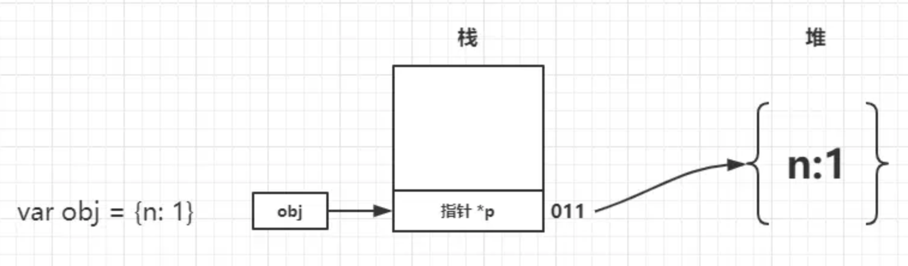
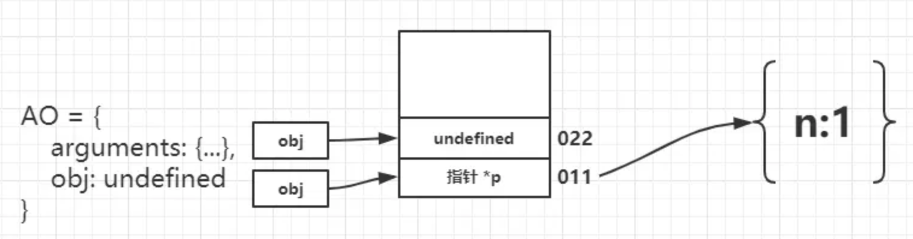
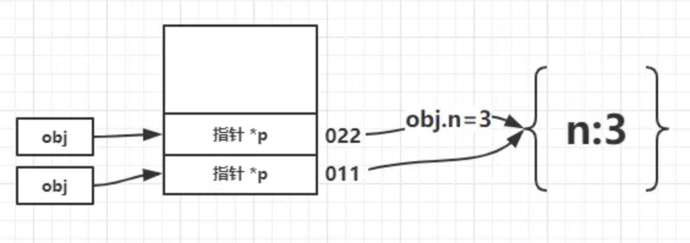
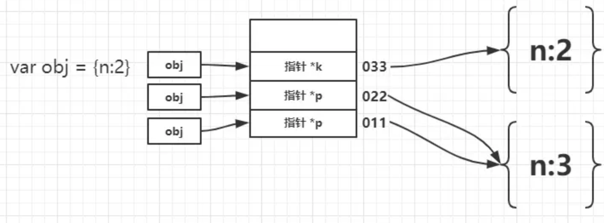

# 图解JavaScript的参数传递

## 参数到底如何传递

> ECMAScript中所有函数的参数都是按值传递的

这个值如果是简单类型，那么就是其本身。如果是引用类型也就是对象传递的就是指向这个对象的地址。故我们可以认为参数传递全部都是值传递，那么具体怎么理解呢？看下面例子：

## 第一个例子

```
var obj = {
  n: 1
}
function foo(obj) {
  data = 2;
  console.log(data);  // 2
}
foo(obj);
console.log(obj.n); // 1
```

先不说为什么，我们就通过画图的方式来走一遍流程，我相信应该就能理解其中的参数传递了。切记传递引用类型传递的是指针！


首先执行 var obj = {n:1} 可以看做在栈的 001 地址中存入了一个指向 {n:1} 的指针 \*p


接下来为声明 function foo 此时会创建函数执行上下文，产生一个变量对象，其中声明了形参 data，由于函数没有执行，当前值为 undefined。我们记 data 地址为 022。


执行 foo(obj) 其中会进行参数传递，其中将 obj 中存储的 \*p 拷贝给处在 022 地址的 data，那么此时它们就指向了同一个对象，如果某一个变量更改了 n 的值，另一个变量中 n 的值也会更改，因为其中保存的是指针。 


进入函数内部，顺序执行 data=2；此时 002 地址存储了基本类型值，则直接存储在栈中，从而与堆中的 {n:1} 失去了联系。从而打印 console.log(data) //2，最后发现初始开辟的 {n:1} 对象没有过更改，故而 console.log(obj.n) // 1 任然打印 1

## 第二个例子

```
var obj = {n:1}
(function(obj){
  console.log(obj.n);
  obj.n = 3;
  var obj = {n:2}
  console.log(obj.n);
})(obj)
console.log(obj.n);
```

整体来看这个例子中出现了同名覆盖的问题。不太了解代码如何执行的流程，可能会因为同名的关系而有些混乱，不过没关系。只要按照上一个例子的流程图中的执行过程，一定可以得出正确的结果。



声明变量obj，地址为011其中存入指向{n:1}的指针\*p



声明函数，虽然同为obj变量名，但是形参obj为AO中的属性，不会与全局造成覆盖，其拥有新的地址记作022，在未执行前其值为undefined。


函数立即执行，此时将全局obj赋值给形参obj，我们忽略这个重复命名的问题，其实就是将011中的 指针\*p拷贝了一份给了022。同时执行第一个console.log(obj.n)结果即为1。



执行obj.n=3，此时为函数的形参即022中的obj来改变了对象内n的值。



最关键的一步：var obj = {n:2}; 由于对象命名的关系可能很多童鞋就会有点懵，但依然按照同样的方式来分析即可，由于使用了var那么就是新声明一个对象，从而会在栈中压入新的地址记作033，其中存入了新的指针指向了新的对象{n:2}。从而之后打印的console.log(obj.n)结果则应是新开辟的对象中的n的值。

最后打印 console.log(obj.n) //3很显然，全局的对象有过一次更改其值为3。

## 小结

至此我们走完了上述两段代码涉及变量的所有“心路历程”，这个图中对于堆栈以及变量重名的描述可能不是非常的准确，有差错的地方还望不吝赐教~重点是能理解我希望表达的意思就好。总的来说关键点就在于传参的过程中存在一次值的拷贝，同时如果赋值对象是引用类型传入的是指针，明白这两点之后再加上之前流程图的分析相信再遇到类似的问题都可以有较为一致的思路了。
