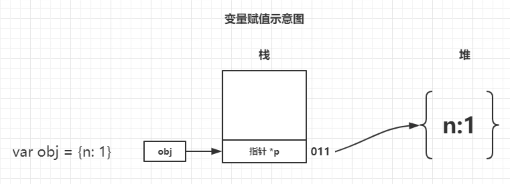
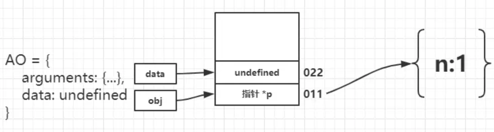
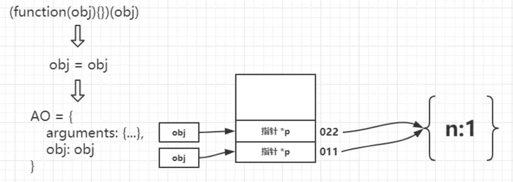
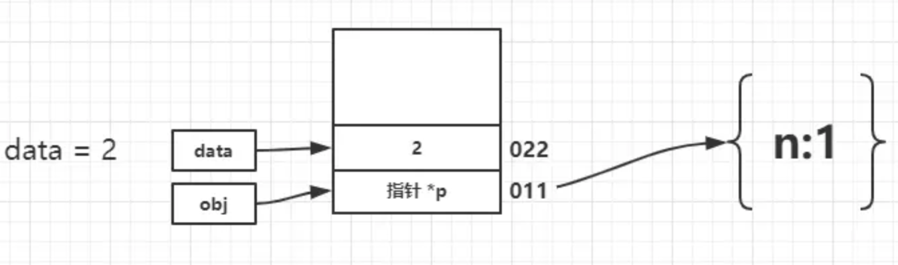

# 图解JavaScript的参数传递

## 参数到底如何传递

> ECMAScript中所有函数的参数都是按值传递的

这个值如果是简单类型，那么就是其本身。如果是引用类型也就是对象传递的就是指向这个对象的地址。故我们可以认为参数传递全部都是值传递，那么具体怎么理解呢？看下面例子：

## 第一个例子

```
var obj = {
  n: 1
}
function foo(obj) {
  data = 2;
  console.log(data);  // 2
}
foo(obj);
console.log(obj.n); // 1
```

先不说为什么，我们就通过画图的方式来走一遍流程，我相信应该就能理解其中的参数传递了。切记传递引用类型传递的是指针！



首先执行 var obj = {n:1} 可以看做在栈的 001 地址中存入了一个指向 {n:1} 的指针 \*p



接下来为声明 function foo 此时会创建函数执行上下文，产生一个变量对象，其中声明了形参 data，由于函数没有执行，当前值为 undefined。我们记 data 地址为 022。



执行 foo(obj) 其中会进行参数传递，其中将 obj 中存储的 \*p 拷贝给处在 022 地址的 data，那么此时它们就指向了同一个对象，如果某一个变量更改了 n 的值，另一个变量中 n 的值也会更改，因为其中保存的是指针。 



进入函数内部，顺序执行 data=2；此时 002 地址存储了基本类型值，则直接存储在栈中，从而与堆中的 {n:1} 失去了联系。从而打印 console.log(data) //2，最后发现初始开辟的 {n:1} 对象没有过更改，故而 console.log(obj.n) // 1 任然打印 1

